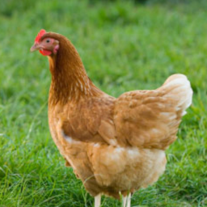
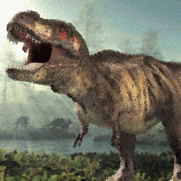

# Image Evolution Script

### Argparse Args

- **fileIn:**  *(required)* Image to evolve
- **fileOut:**  *(required)* Target to evolve towards *"environment"*
- **kernel (-k):**  Adjacent pixels checked
    - k9: *default*

    -1 | 0 | +1 
    --- | --- | --- 
    **X** | **X** | **X** 
    **X** | **p** | **X** 
    **X** | **X** | **X** 

    - k21:

    -2 | -1 | 0 | +1 | +2 
    --- | --- | --- | --- | --- 
    || **X** | **X** | **X** |
    **X** | **X** | **X** | **X** | **X**
    **X** | **X** | **p** | **X** | **X**
    **X** | **X** | **X** | **X** | **X**
    || **X** | **X** | **X** |

    - k35:

    -3 | -2 | -1 | 0 | +1 | +2 | +3
    --- | --- | --- | --- | --- | --- | --- 
    ||| **X** | **X** | **X** ||
    || **X** | **X** | **X** | **X** | **X** |
    **X** | **X** | **X** | **X** | **X** | **X** | **X**
    **X** | **X** | **X** | **p** | **X** | **X** | **X**
    **X** | **X** | **X** | **X** | **X** | **X** | **X**
    || **X** | **X** | **X** | **X** | **X** |
    ||| **X** | **X** | **X** ||

- **method (-m):**  Way of selecting genitors/children
    - std: *default*

- **sigma (-s):**  Rate of random mutations
    - float value
    - 0.1: *default*

- **generations (-g)**:  Number of generations to evolve
    - int value
    - 8: *default*

- **output** (-o):  Export .gif animation, or  individual frames as images
    - gif:  full animation as .gif *default*
    - png:  individual frames as images

### Example

trex.png

chic.png

`$ python3 evo.py "trex.png" "chic.png"`

animation.gif

